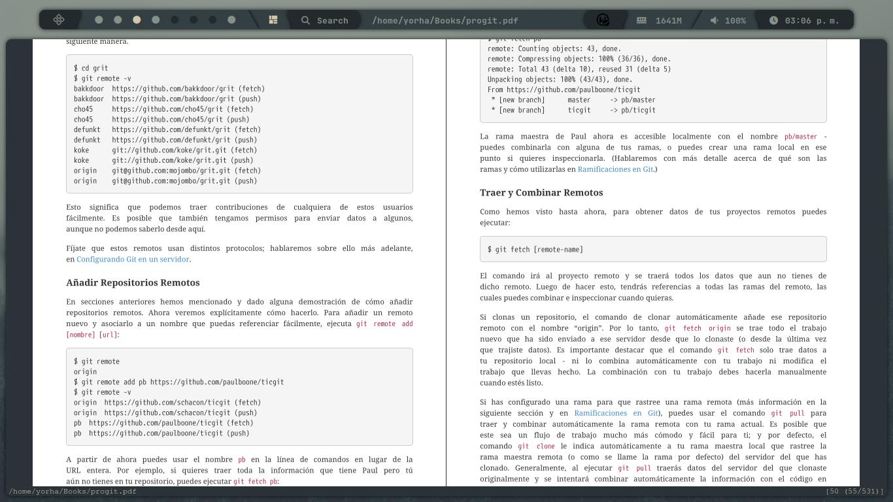
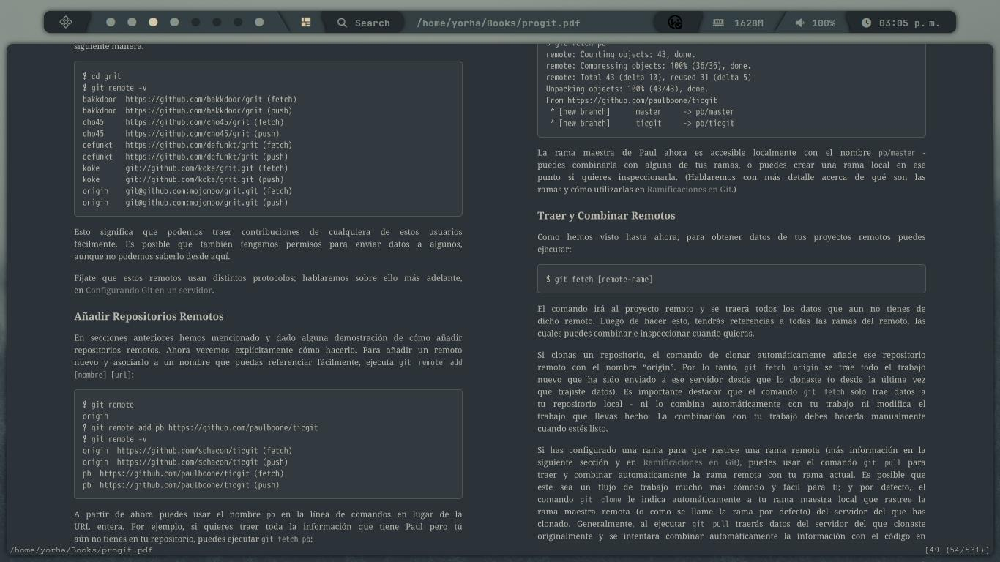

# Everforest Theme for Zathura

This repository contains the Everforest color theme for Zathura, featuring soft, earthy tones for a calm reading experience.

## Installation

1. **Arch Linux**:
   ```bash
   sudo pacman -S zathura zathura-pdf-mupdf

2. **Debian/Ubuntu**:
   ```bash
   sudo apt update
   sudo apt install zathura zathura-pdf-poppler

3. **Fedora**:
   ```bash
   sudo dnf check-update
   sudo dnf install zathura zathura-pdf-mupdf

**Clone the Repository**
After installing Zathura, clone this repository and copy the theme to Zathura's config directory:
```bash
git clone https://github.com/ItaruYasha/everforest-zathura-theme.git
cd everforest-zathura-theme
cp . ~/.config/zathura/zathurarc

## Example

**Before**:


**After**:

